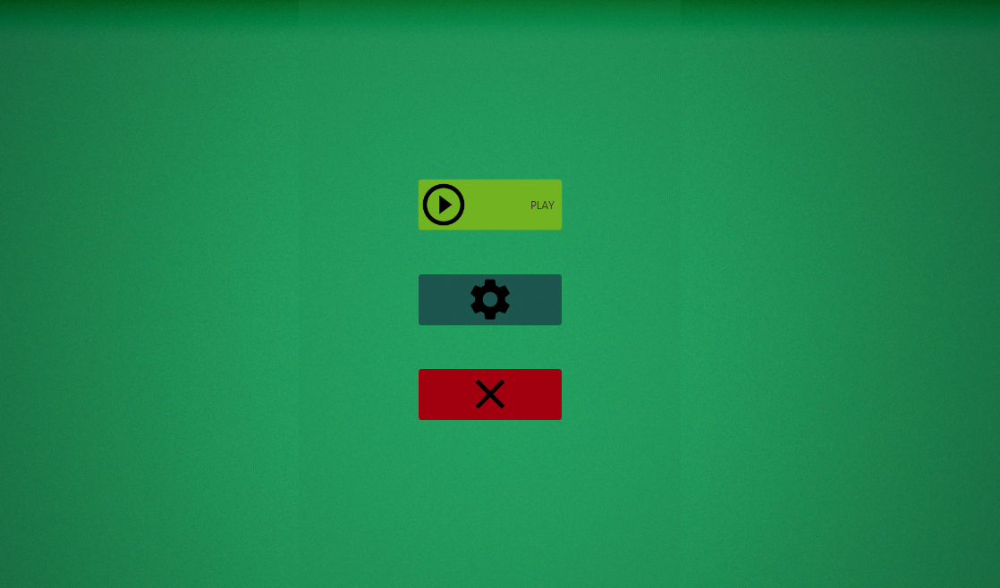

Kaardimäng "Fool".
***
* MÄNGU PROTSESS:
* Enne mängu alustamisest:
* Esimese sammu teeb inimene, kes alustas esimesena mänguotsingut.
* Mängu Deck genereeritakse enne mängu alustamisest Serveril.
* Deckis on 36 kaardi.
* Kaardid Deckis segatakse omavahel.
* Pärast võetakse 13 kaardi, mida pannakse Decki lõppu ning mis saab Trumbi kaardiks.
* Iga mängija saab 6 kaarti(Card).
* Mäng algab:
* Esimene mängija algab rünnakut.
* Ta valib hiirega kaarti, mida tahab panna lauale vajutab kaardi peale ning kohale, kuhu on vaja seda panna laua peal.
* Laual saab olema samal ajal ainult üks kaart, mida on vaja tappa.
* Kui tapmine õnnestub, siis rünnakut saab jätkata ning esimene mängija jälle saab panna kaarti lauale või vajutada nuppu "THROW".
* Samm jätkub kuni ründaja vajutab nuppu "THROW".
* Õnnestunud kaitsmise korral kõik tapetud kaardid lähevad (class PILE)
* Kaitsjal on võimalus vajutada nuppu "TAKE".
* "TAKE" nupp võttab kaarte, mis on praegu laual.
* Iga mängija, kellel on vähem kui 6 kaarte võtab kaarte deckist kuni mängijal käes on jälle 6 kaarte.
* Käigu saab kaitsja, kui kaitsmine õnnestus või jälle ründaja, kui see ebaõnnestus.
* Mäng käib samamoodi kuni Deckis ei lõppe kaardid.
* Pärast seda mängijad ei võta kaardid Deckist ning nende eesmärk on kasutada kõike oma kaarte(et nende käes polnud kaarte).
* Esimene mängija, kes kasutas kõike oma kaarte saab võitjaks.
* Võitja ja kaotaja tuvastamine toimub ainult käikude vahel(pärast nupude "THROW", "TAKE" vajutamist).
* Kui kaardid teie käes on lõppenud, aga käik ei, siis te saate vajutada nuppu "SKIP" ning mäng kontrollib mängulõppu tingimusi.
* Mängija, kes ei kasutanud kõike oma kaarte enne teist mängijat saabki "FOOLIKS"
* MÄNG VS AI:
* See toimub samamoodi nagu mäng vs playerit, aga et alustada mängu pole vaja oodata teist inimest ning AI mängib vastavalt enda loogikat.
* SOME IMPORTANT RULES:
* Kaardi saab tappa ainult kaart, mis on sama masti ning mille väärtus on suurem, kui ründkaardil .
* Ründkaardi, mis pole trumbimastist, saab tappa ükskõik mis trumbimastist kaardiga.
* Trumbimasti ründkaardi saab tappa ainult kõrgema väärtusega trumbimastist kaart.
* Kaartide value ("6"<"7"<"8"<"9"<"10"<"J"<"Q"<"K"<"A").
* MENU:

* REŽIIMID:

* SETTINGS:

***
KASUTATUD TEHNOLOOGIAD:
* Kood on kirjutatud Java keeles.
* Server on tehtud kasutades Netty tehnoloogiaid(Java keeles).
* Kaardide piltide jaoks oli kasutatud CSS.
* Visuaalne osa oli tehtud JavaFX-iga.
***
ARHITEKTUURILINE JOONIS:

***
SERVER:
* Mängu alguses Serverile saadakse sõnumit sellest(JSON).
* Server loob GameInfo klassi, mis saab meie mänguks. (Selles on Deck, trump, kelle käik on, AI jms.)
* Ta saadab seda klassi infot mängijatele, kui nad paluvad Update oma mängust. 
* Iga käigu lõppus saadakse serverile sõnumit, kus mängija palub endale kaardid ning vastavalt sellele kas deckis on veel kaardid või ei, server saadab tagasi listi kaartidest.
* Kui mägija paneb lauale kaardi, siis serverile saadakse sõnum kaardiga ning server lisab seda kaardi lauale GameInfos ja juba sealt teine mängija saab sellest teada.
* Mängijad saavad veel saada kolm sõnumit serverile kas "THROW", mis tähendab, et käik on lõpetatud või "TAKE", mis tähendab, et mängija võttis kaarte või "SKIP", mis kontrollib mängu lõpetamist.
* Edastamiseks on kasutatud TCP protokoll. 
* Server tuvastab mängijaid vastavalt UUID-le, mida nad saadavad igas oma sõnumis.
***
AI:
* AI asub serveri peal.
* AI on nagu tavaline mängija, mis paneb kaardid lauale, aga tal on oma loogika.
* AI TEEB OMA KÄIGUD:
* vastavalt situatsioonist laualt, 
* vastavalt kaartidest, mis on juba väljunud mängust, 
* vastavalt kaartide omadustest(Nt, kui tal on mitu sama väärtusega kaarti)
* mängu lõpus ta saab teada inimese kaartid tänu sellele, et ta mäletab kõike kaarte mis on väljunud
* Suurim miinus:
* AI loogika jaoks trumbi kaardid pole nii tähtsad võrreldes tavalise mängijaga.
***
Mängu installeerimise juhend:
Download https://drive.google.com/file/d/1Z0DfRBqL7MMOZBiAgrQIYqIa-5eVndbI/view?usp=sharing ja klikida selle peale.
P.S. Mängu jaoks on vajalik java 11(preferably oracle) või kasutage command prompt.
Avage command prompt -> kirjutage: cd path to the folder, where the file is located -> kirjutage: java -jar fool.game-1.0-SNAPSHOT.jar

